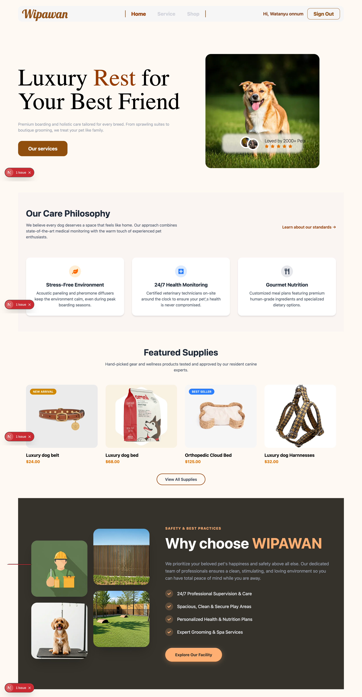
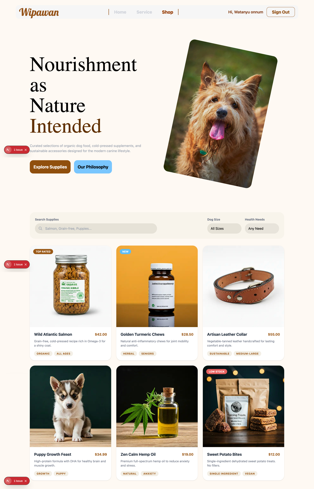
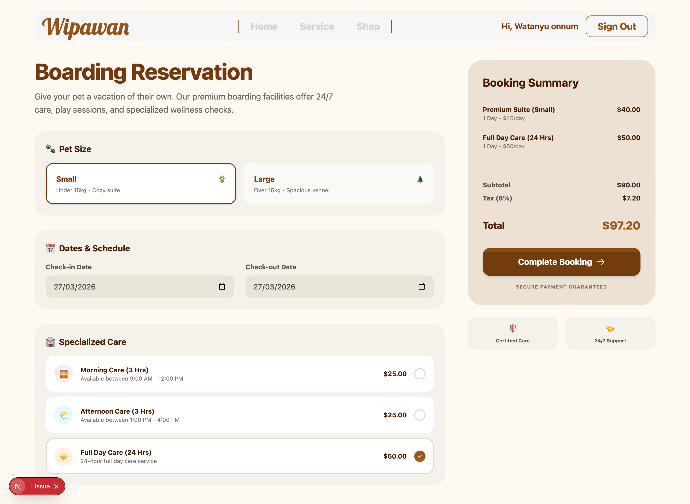

# 🐾 Wipawan - Premium Pet Care & Boarding

ยินดีต้อนรับสู่โปรเจกต์ **Wipawan (Animal Care)** เว็บแอปพลิเคชันสำหรับบริการดูแลสัตว์เลี้ยงแบบครบวงจร ที่ถูกออกแบบมาเพื่อส่งมอบประสบการณ์ระดับพรีเมียมให้กับทั้งเจ้าของและสัตว์เลี้ยงแสนรัก ทั้งบริการรับฝาก (Boarding), สปา, คลินิกสุขภาพ และยังมีร้านค้าสำหรับเลือกซื้อผลิตภัณฑ์ออร์แกนิคอีกด้วย!

---

## 🚀 Tech Stack ที่ใช้ในโปรเจกต์นี้

- **Framework:** [Next.js (App Router)](https://nextjs.org/)

- **Styling:** [Tailwind CSS](https://tailwindcss.com/)

- **Authentication:** [NextAuth.js](https://next-auth.js.org/) 

- **Database:** MongoDB

---

## 📸 พรีวิวหน้าต่าง ๆ ของเว็บไซต์ (Project Review)

### 1. หน้าแรก (Home / Landing Page)
หน้าแรกที่ต้อนรับผู้ใช้งานด้วยดีไซน์ที่อบอุ่น อธิบายถึงมาตรฐานการดูแล (Care Philosophy)

### 2. บริการของเรา (Services & The Healthy Care Approach)
หน้านี้จะเจาะลึกถึงแนวทางการดูแลสุขภาพโดยใช้โภชนาการที่อิงตามหลักวิทยาศาสตร์ (Science-Backed Nutrition) การจัดสรรพื้นที่วิ่งเล่น (Active Play) และการรับรองความปลอดภัยตลอด 24 ชั่วโมง

### 3. ร้านค้า (Shop / Supplies)
นอกจากการดูแลแล้ว เรายังมีหน้าร้านค้าออนไลน์ที่รวบรวมสินค้าคุณภาพสูง เช่น อาหารเปียกออร์แกนิค ขนมเพื่อสุขภาพ และอุปกรณ์ดีไซน์สวยงาม ให้เจ้าของได้เลือกซื้ออย่างง่ายดาย

### 4. ระบบการจอง (Boarding Reservation)
ระบบการจองที่ออกแบบมาให้ใช้งานง่าย (User-friendly) ผู้ใช้สามารถเลือกขนาดของสัตว์เลี้ยง กำหนดวันเข้าพัก (Check-in/Check-out) และเลือกเพิ่มบริการเสริม (Specialized Care) ได้ตามใจชอบ ระบบจะสรุปราคาให้เห็นอย่างชัดเจนก่อนทำการชำระเงิน

*Pet care isn't just a service; it's a commitment to happiness.* 🐶✨